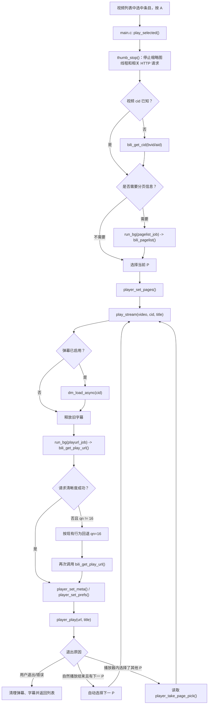
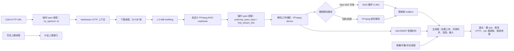
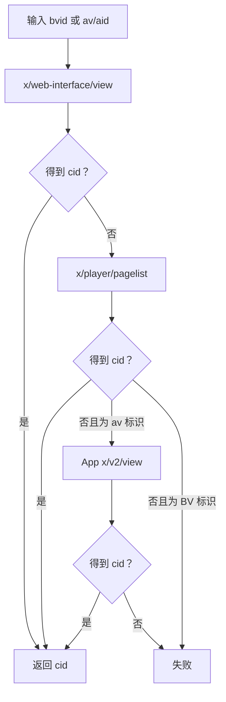
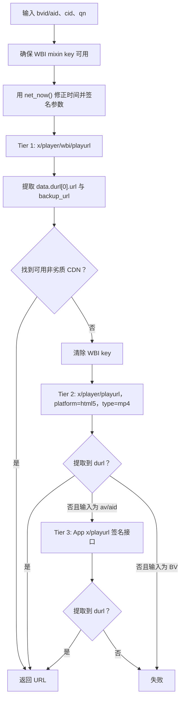
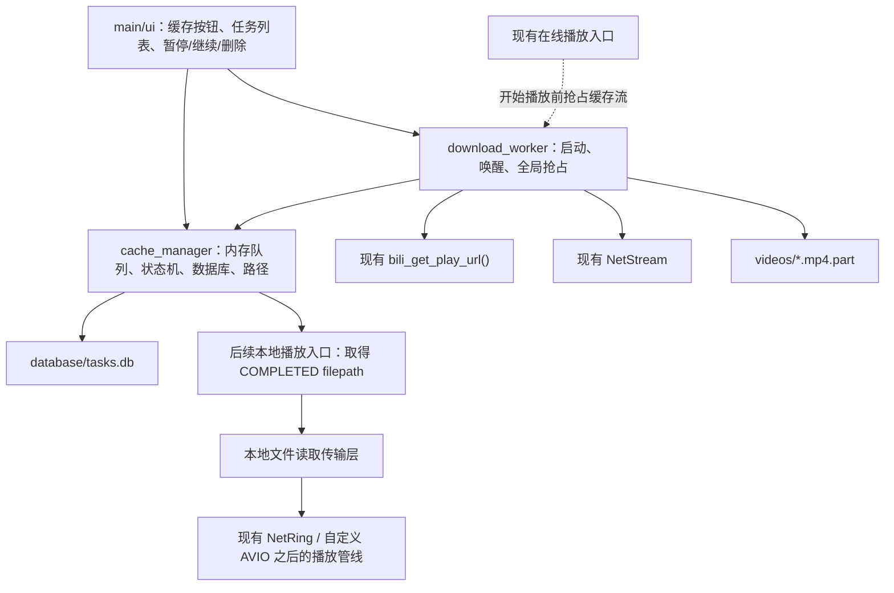
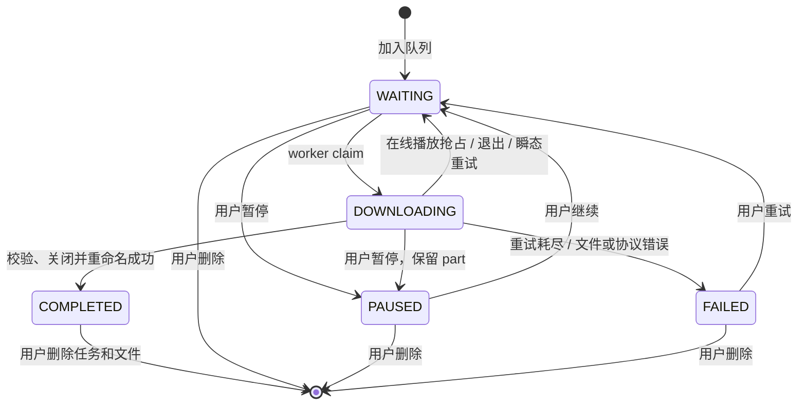
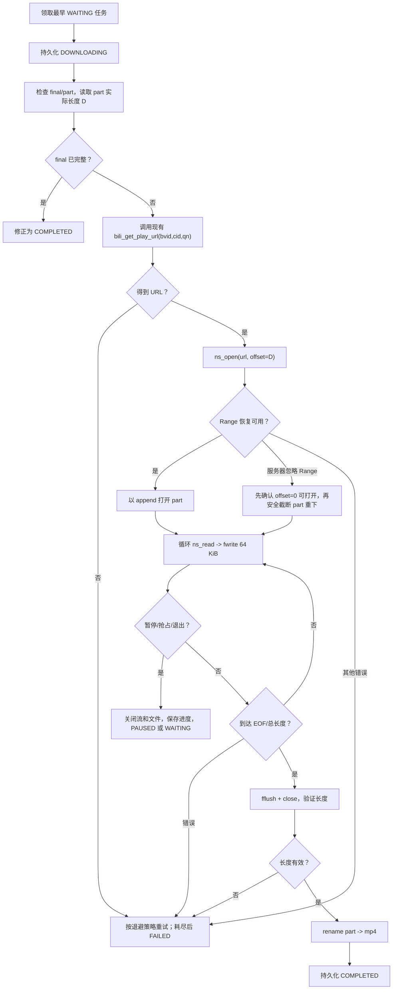
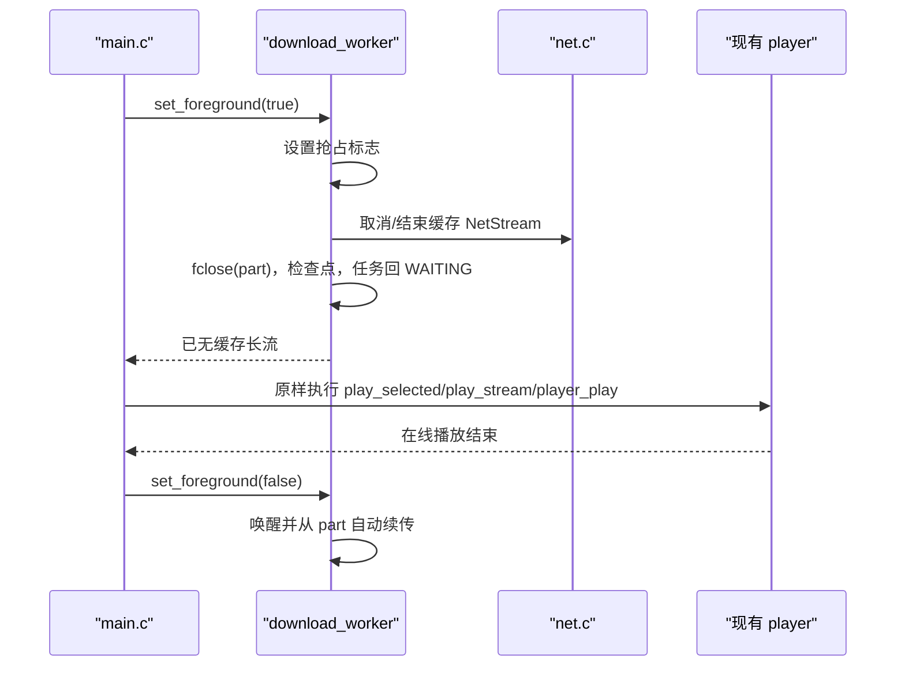

# bilibili / 3Danmu Offline Cache Manager 设计与实现说明

> 状态：设计已落地到 `cache_manager`、`download_worker` 与本地播放输入适配
> 源码基线：`OakRoller/3Danmu` `main` 分支提交 `34ff1e0e04611077ecd9b203b19f912c199fe460`（2026-08-02）
> 阅读范围：`README.md`、`DEVELOPING.md`，以及题目指定的 `player`、`net`、`bili`、`ui`、`main`、`settings` 源文件；为核对 SD 卡管理方式，额外阅读了 `thumb.c/.h`。

## 0. 结论摘要

Offline Cache Manager 可以在不改变现有 B 站接口实现、FFmpeg 解码流程和在线播放入口行为的前提下加入。推荐的边界是：

- `cache_manager` 只管理任务、状态、路径和持久化，不访问 B 站、不下载、不播放。
- `download_worker` 是唯一的后台下载线程；复用现有 `bili_get_play_url()` 和 `NetStream`，将渐进式 MP4 写入 `.part`。
- 播放在线流之前，先协作式抢占缓存下载并关闭其 `NetStream`；在线播放结束后自动唤醒下载线程。这避免两个长连接竞争 3DS 的 `httpc`，优先保证现有在线播放。
- CDN URL 不写入数据库。每次首次下载、断点恢复或重试都按稳定的 `bvid/cid/qn` 重新获取 URL，避免 URL 过期。
- `.part` 的实际文件长度是恢复进度的最终依据；数据库中的 `downloaded_size` 只是最近一次检查点。
- 下载完成后先关闭并校验 `.part`，再重命名为 `.mp4`，最后持久化 `COMPLETED`。
- 离线播放在后续阶段只需增加“本地文件输入传输层”：由文件读取线程继续填充现有环形缓冲区，FFmpeg demux/decode、MVD、音频、渲染流程均不改变。

原始第一阶段只做设计；用户随后授权开发，目前本文同时记录已实现的约束与仍需实机验证的项目。

---

## 1. 当前视频播放流程

### 1.1 从视频列表到播放器



当前 `main.c` 在进入播放前停止缩略图工作，避免缩略图请求继续占用网络；分页、播放 URL 等短任务通过临时后台线程运行，但主线程仍负责等待期间的 busy UI。

### 1.2 `player_play()` 内部运行管线



关键事实：

- 在线媒体不落地，下载线程只向 1.5 MiB 环形缓冲区写数据。
- `NetStream` 的 HTTP 上下文必须由实际使用它的线程创建或重新绑定；播放器下载线程通过 `ns_rebind()` 遵守该约束。
- FFmpeg 从自定义 AVIO 读取环形缓冲区，不直接操作 HTTP。
- New 3DS 优先使用 MVD；失败时以同一 URL 回退软件解码。离线缓存设计不得触碰这一分支逻辑。
- 主线程只做 UI、输入、帧上传与呈现，不应承担 SD 卡持续写入。

---

## 2. 当前 B 站视频 URL 获取流程

### 2.1 CID 获取

如果列表结果没有 CID，现有代码按以下顺序获取：



多 P 视频的完整分页列表优先请求 `x/player/pagelist`，失败时从 `x/web-interface/view` 的 `data.pages` 提取。

### 2.2 播放 URL 获取

`bili_get_play_url(bvid, cid, qn, ...)` 当前只获取 `durl` 渐进式媒体地址，不接受仅有 DASH 的结果。



URL 选择会检查主地址和备用地址，并尽量避开 `mcdn`、P2P、`szbdyd` 等已知不理想节点；如果所有候选都不理想，仍可能使用第一个候选。

### 2.3 对离线缓存的直接影响

- CDN URL 是短期凭据，不能作为队列的持久标识。
- 缓存任务必须持久化 `bvid/cid/aid/qn`，在每次开始或恢复下载时重新调用现有 `bili_get_play_url()`。
- 下载模块不得复制 WBI、App 签名、CID、分页或 URL 解析代码。
- 第一阶段建议缓存任务严格下载其记录的 `qn`，不在已有 `.part` 上静默降清晰度，否则可能把两个不同媒体对象拼接在一起。新任务若需要 360P，应明确建立 `qn=16` 的任务。

---

## 3. 当前网络线程模型

### 3.1 请求类别与串行化

| 类型 | 当前入口 | 串行化/线程规则 | 典型调用者 |
|---|---|---|---|
| 短 GET/POST | `net_get*`、`net_post*` | 共用全局 `LightLock s_req_lock`；同一时刻一个短 HTTP 请求 | B 站 API、历史上报、弹幕相关请求 |
| 图片 GET | `net_get_img()` | 实际实现同样使用 `s_req_lock`；下载结束后的 JPEG 解码可与其他线程重叠 | 缩略图线程 |
| 长媒体流 | `NetStream` | 不持有短请求全局锁；上下文必须在所有者线程创建/使用/关闭 | 播放器下载线程 |
| 取消与退出 | in-flight registry、`net_shutdown_begin()` | 登记最多 4 个活动上下文；退出时禁止新请求并取消活动连接 | 全局退出路径 |

`httpc` 在该项目的实测行为不适合并行短请求，因此即使 New 3DS 有两个缩略图加载线程，HTTP 阶段仍被全局锁串行；并行收益主要来自图片解码。

### 3.2 主要线程

| 线程 | 栈/优先级（当前源码） | 核心偏好 | 职责 |
|---|---:|---|---|
| 主线程 | 应用主栈 | core 0 | UI、输入、渲染、生命周期 |
| `run_bg` 临时任务 | 16 KiB / `0x31` | 2、3、`-2` | 列表、分页、播放 URL 等短后台任务 |
| 播放下载线程 | 32 KiB / `0x2E` | 2、3、`-2` | `NetStream -> NetRing` |
| 播放解码线程 | 160 KiB / `0x2F` | 2、3、`-2` | FFmpeg demux/decode、MVD/软件视频解码、音频 |
| 历史上报线程 | 16 KiB / `0x3A` | 3、2、`-2` | 播放历史 POST |
| 弹幕/字幕/评论线程 | 32 KiB / `0x38` | 3、2、`-2` | 对应数据加载与解析 |
| 缩略图线程 | 96 KiB / `0x3A` | New 3DS 分别偏好 2、3；Old 3DS 为 1 个 | HTTP 图片加载、JPEG 解码、SD 缓存 |
| trace 写入线程 | 16 KiB / `0x3C` | `-2` | 异步追加日志，避免主线程写 SD |

`DEVELOPING.md` 中部分较早的示意图写过 core 1；当前源码实际在线程亲和性选择中优先尝试 core 2、core 3 和自动核心 `-2`，设计应以源码为准。

### 3.3 对新下载线程的约束

新模块只增加一个长期线程：

- 同一时刻最多一个缓存任务处于 `DOWNLOADING`。
- 线程建议使用 48–64 KiB 栈、低于播放器下载/解码线程的调度优先级，并采用现有的 2、3、`-2` 回退策略。
- `bili_get_play_url()` 与 `NetStream` 的创建、读取、重连、关闭均由该线程完成，满足 HTTP 上下文的线程亲和性。
- 管理器锁保护内存队列和最多约 54 KiB 的数据库快照提交；持锁期间绝不进行
  DNS、HTTP 或等待线程，媒体 `.part` 写入也不持该锁。
- 在线播放拥有绝对优先级。播放器开始前通知下载线程抢占当前任务，保留 `.part`、关闭 HTTP 上下文并确认已经停流；播放器退出后再恢复。
- 浏览、搜索的短 API 请求可以按现有模型与唯一的缓存长流共存。不得再增加第二个缓存长流。

---

## 4. 当前 SD 卡文件管理方式

当前应用根目录为 `sdmc:/3ds/3danmu/`，各功能独立管理文件，没有统一数据库层。

| 路径 | 所属模块 | 当前方式 |
|---|---|---|
| `settings.txt` | `settings.c` | `key=value` 文本；最多 32 项；修改后以 `fopen("w")` 重写整个文件 |
| `cookies.txt` | `net.c` | `name=value` 文本；内存最多 24 个 cookie；保存时整文件重写，并防止意外覆盖磁盘上的 `SESSDATA` |
| `trace.log` | `ui.c` | 低优先级线程排队追加；超过约 64 KiB 时截断重建；队列满时丢弃新日志 |
| `thumbs/<hash>.jpg` | `thumb.c` | URL 64 位哈希命名；直接读写 JPEG；按估算数量控制约 100 MiB 上限，清理时整体删除而非 LRU |
| `sdmc:/3ds/dspfirm.cdc` | 音频运行环境 | 位于应用根目录之外，由系统/部署提供 |

现状特征：

- 目录通过重复调用 `mkdir()` 幂等创建。
- `settings.txt`、`cookies.txt` 和缩略图文件没有通用的 `.tmp -> rename` 事务协议。
- trace 已专门移到后台线程，因为主线程上的 SD 写入可能造成明显卡顿。
- 设置文件保存的是平台整数和文本，不直接序列化 C 结构体。
- 退出时必须先停止、取消并 join 仍可能访问网络或文件系统的线程，再拆除 `httpc`、UI 和应用运行环境。
- 当前没有视频缓存目录、视频数据库或断点文件。

Offline Cache Manager 不应复用 `settings.txt`：任务数量、UTF-8 元数据、64 位大小、状态变迁和崩溃一致性都超出了该设置存储的职责。

---

## 5. 新模块总体设计

### 5.1 模块关系



依赖方向：

- `cache_manager` 不依赖 `bili`、`net`、`player` 或 UI。
- `download_worker` 依赖 `cache_manager`、`bili` 和 `net`。
- UI/main 只调用公开 API，不读取内部数组，也不直接写数据库。
- `player` 不依赖下载线程；main 在调用播放器之前执行抢占协调。

### 5.2 SD 卡目录

```text
sdmc:/3ds/3danmu/cache/
├── videos/
│   └── <清洗后的UP主名>/
│       ├── <清洗后的原视频标题>.mp4.part
│       └── <清洗后的原视频标题>.mp4
└── database/
    ├── tasks.db
    ├── tasks.db.tmp
    └── tasks.db.bak
```

规则：

- 默认目录名使用 UP 主名，文件名使用原视频标题；只替换 FAT 不允许的字符并按 UTF-8 字符边界截断。
- 同一 UP 主目录下发生同名冲突时，在标题后追加 `[bvid-cid-qn]`，绝不覆盖已有缓存或其它清晰度。
- 若确定性后缀仍被数据库外的孤立文件占用，入队失败并提示检查 SD 卡，
  不自动认领或覆盖无法确认归属的文件。
- `filepath` 是规范化的最终 `.mp4` 路径；临时路径由它追加 `.part` 得到。
- 数据库载入时不信任持久化路径。管理器根据任务键重新生成规范路径，拒绝包含 `..`、反斜杠、额外冒号或逃逸缓存根目录的记录。
- 所有删除操作都必须先验证目标位于 `cache/videos/` 且文件名与任务键相符。

---

## 6. `cache_manager.c/.h` 设计

### 6.1 职责

1. 维护固定上限的任务数组和 FIFO 选择顺序。
2. 校验、去重并加入任务。
3. 实现状态机和线程安全的快照查询。
4. 创建缓存目录、加载/保存数据库。
5. 启动时用真实文件状态修复数据库进度。
6. 提供下载线程的 claim/progress/complete/fail 接口。
7. 不发起网络请求，不解析 B 站响应，不播放媒体。

建议上限为 64 个任务。固定数组避免长期运行中的碎片化，内存开销约几十 KiB；产品层只允许用户逐个加入视频/P，不提供 UP 主、收藏夹或分区批量抓取。

### 6.2 公共数据结构

实现采用以下公开结构（实际 `filepath` 为 512 字节）：

```c
typedef enum {
    DOWNLOAD_STATUS_WAITING,
    DOWNLOAD_STATUS_DOWNLOADING,
    DOWNLOAD_STATUS_PAUSED,
    DOWNLOAD_STATUS_FAILED,
    DOWNLOAD_STATUS_COMPLETED
} DownloadStatus;

typedef struct {
    char bvid[16];
    int64_t cid;
    int64_t aid;
    char title[200];
    char author[64];
    int qn;
    DownloadStatus status;
    uint64_t downloaded_size;
    uint64_t total_size;
    char filepath[512];
    int64_t created_time;
} DownloadTask;
```

持久化状态字符串使用题目指定的 `WAITING`、`DOWNLOADING`、`PAUSED`、`FAILED`、`COMPLETED`；C 枚举加前缀以避免全局符号冲突。

约束：

- `bvid` 必须以 NUL 结尾并符合当前可接受格式；若仅有 aid，入队前仍应通过现有列表/CID 数据尽量补齐 bvid。`aid` 可为 0，但 `bvid + cid + qn` 必须能唯一定位任务。
- `cid > 0`，`qn` 第一阶段只允许现有播放器已支持的 16/32。
- 标题、作者按 UTF-8 字节安全截断，不能切在多字节字符中间。
- 大小使用 `uint64_t`；日志显示时不得依赖项目已知不兼容的 `%lld`，应复用手工 64 位转字符串方式。
- `created_time` 使用 `time(NULL)`，仅用于稳定排序和显示，不作为安全依据。

建议另定义不持久化的任务键：

```text
CacheTaskKey = (bvid, cid, qn)
```

相同键再次加入时返回“已存在”及现有任务，不创建重复下载。

### 6.3 已实现的公开 API

| API 类别 | 接口 | 语义 |
|---|---|---|
| 生命周期 | `cache_manager_init()` / `cache_manager_shutdown()` | 创建目录、恢复数据库、最终落盘 |
| UI 写操作 | `cache_manager_enqueue()` | 校验并加入 WAITING；不持有调用方对象指针 |
| UI 控制 | `cache_manager_pause()` / `resume()` / `retry()` / `remove()` | 只执行合法状态转换并唤醒 worker |
| UI 查询 | `cache_manager_snapshot()` | 复制任务；绝不返回内部可变指针 |
| Worker 领取 | `cache_manager_claim_next()` | 选择最早 WAITING，原子改为 DOWNLOADING |
| Worker 更新 | `cache_manager_update_progress()` | 更新 64 位进度；按检查点决定是否落盘 |
| Worker 完成 | `cache_manager_mark_completed()` | 仅在最终文件已经提交后调用 |
| Worker 失败 | `cache_manager_mark_failed()` / `mark_waiting()` | 区分失败与播放抢占/退出重排队 |

错误码、重试次数、下次重试时间和“被在线播放抢占”等属于 `cache_manager.c` 私有运行时数据，不必污染题目规定的 `DownloadTask`。如需跨重启展示错误，可在版本化数据库记录中增加可选字段，但公开任务结构保持不变。

### 6.4 状态机



状态不变量：

- 全队列最多一个 `DOWNLOADING`。
- 用户暂停才持久化为 `PAUSED`；在线播放抢占、睡眠和正常退出不会把任务误记为用户暂停，而是回到 `WAITING`。
- 重启时发现的 `DOWNLOADING` 一律规范化为 `WAITING`。
- `COMPLETED` 必须对应存在且已关闭的最终 `.mp4` 文件。
- `.part` 存在不代表任务正在下载；它可以属于 `WAITING`、`PAUSED` 或 `FAILED`。

### 6.5 数据库格式

不直接 `fwrite(sizeof(DownloadTask))`，因为结构体填充、枚举宽度、编译器版本和尾端序会破坏兼容性。

实现使用版本化二进制快照：固定宽度 `DbHeader + DbTask[]`，不直接写公开
`DownloadTask`。头部含 magic、版本、记录数、generation 和 FNV-1a 32 校验；
记录使用明确的 `int32_t/int64_t/uint64_t` 字段和固定 UTF-8 字节数组。
3DS/devkitARM 是小端目标，数据库只在该目标上消费。未知版本、越界记录数、
非法任务键、校验不符和尾部多余字节都会使整个候选文件失效。

### 6.6 原子保存和 SD 磨损控制

每次提交快照：

1. 写 `tasks.db.tmp`。
2. `fflush()`、关闭文件；devkitARM/newlib 环境确认支持时再调用 `fsync()`。
3. 删除旧 `tasks.db.bak`。
4. 将当前 `tasks.db` 重命名为 `tasks.db.bak`。
5. 将 `tasks.db.tmp` 重命名为 `tasks.db`。
6. 若最后一步失败，保留或恢复 `.bak`，并返回错误。

启动时校验 `tasks.db`、`.tmp`、`.bak`，选择校验通过且 generation 最大者，再立即规范化保存。

保存触发点：

- 入队、暂停、继续、失败、完成和删除：尽快保存。
- 下载进度：每增加至少 1 MiB或每 5 秒保存一次，取先到者。
- 抢占、睡眠和退出：强制进度检查点。
- 所有数据库写都封装在 manager 锁内；入队/控制操作会同步提交这个最多约 54 KiB
  的快照，下载进度则由 worker 按检查点提交。worker 在开始写任何 `.part`
  前必须先成功持久化 `DOWNLOADING`。

这样可以避免每个 64 KiB 数据块都重写数据库，同时将异常断电后的数据库回退控制在很小范围。即使数据库进度落后，恢复时仍以 `.part` 的 `stat()` 文件长度为准。

### 6.7 启动恢复与文件对账

启动次序：创建目录 → 选择有效数据库 → 加载记录 → 扫描/对账文件 → 保存规范化结果 → 启动 worker。

对每个任务：

1. 重新生成并验证规范路径。
2. `stat()` 最终 `.mp4` 和 `.part`。
3. 最终文件存在且大小与已知 `total_size` 相符：修正为 `COMPLETED`。
4. 最终文件存在但大小与已知总长不符：不覆盖，标记 `FAILED` 并提示用户处理。
5. `.part` 存在：用实际大小覆盖 `downloaded_size`。
6. 数据库为 `DOWNLOADING`：改为 `WAITING`。
7. `COMPLETED` 但最终文件缺失、且 `.part` 存在：改为 `WAITING`；两者都不存在则标记 `FAILED`。
8. 未完成任务没有 `.part`：进度归零；`PAUSED` 保持暂停，其余可继续的状态保持/改为 `WAITING`。
9. `.part` 大于已知总长：禁止继续追加，标记 `FAILED`。

对数据库之外的孤立 `.part`：

- 标题路径无法可靠反推出 `bvid/cid/qn`，因此 worker 必须先持久化任务，再创建 `.part`。
- 数据库之外的孤立文件不自动删除，写入 trace，留给未来的“清理孤立文件”UI。

这保证异常退出不会把 `.part` 当垃圾清除。

---

## 7. `download_worker.c/.h` 设计

### 7.1 职责

1. 维护唯一后台线程和唤醒事件。
2. 从 manager 领取一个 WAITING 任务。
3. 通过现有 B 站接口获取新鲜 URL。
4. 通过现有 `NetStream` 进行顺序/Range 下载。
5. 写入 `.part`、更新进度、处理重试和最终提交。
6. 响应用户暂停、在线播放抢占、HOME/睡眠和应用退出。
7. 不解析 B 站 JSON，不调用 FFmpeg，不直接管理 UI。

### 7.2 已实现的公开 API

| 接口 | 语义 |
|---|---|
| `download_worker_start()` | 创建唯一线程 |
| `download_worker_wake()` | 入队/继续/重试提示（worker 最多 150 ms 轮询） |
| `download_worker_set_foreground(true/false)` | 请求抢占缓存流/允许继续；main 等待 `is_active()` 变为 false |
| `download_worker_notify_suspend(bool)` | HOME/睡眠生命周期协调 |
| `download_worker_cancel_current()` | 用户暂停时取消当前长流 |
| `download_worker_stop()` | 设置退出标志、取消其流、join，保证不再访问 net/SD |
| `download_worker_is_active()` / `status()` | 供协调等待和 UI 状态显示使用 |

`set_foreground(true)` 只置抢占标志并取消流；`main.c` 在不持有 manager 锁时
继续绘制 busy UI，直到 `is_active()` 为 false，确认缓存 `NetStream` 与 `.part`
句柄都已关闭后才进入 `player_play()`。

### 7.3 单任务下载算法



具体规则：

- 建议使用一个 64 KiB 普通堆缓冲区；不申请大块线性内存，不与 MVD 争抢资源。
- 打开断点前先 `stat()`，绝不相信数据库进度。
- 刷新 URL 后若服务端报告的资源总长度与旧任务不同，不拼接旧 `.part`；
  先确认 offset=0 可打开，再安全截断重下。
- `NetStream` 已支持 `Range` 和一次内部重连。外层重试仍应重新获取 URL，因为 403、重定向或长时间暂停可能意味着 CDN URL 已过期。
- 服务器返回 206 时继续追加；如果服务器忽略 Range 并返回完整 200，绝不能把完整响应追加到旧 `.part`。
- 现有 `NetStream` 对较小偏移可丢弃前缀，对大于其保护上限的偏移会失败。worker 捕获该结果后，仅在新的 offset=0 连接已经成功时才截断 `.part` 重下；这是服务器不支持断点时唯一安全退路。
- `fwrite()` 短写、`ENOSPC`、目录不可写、长度溢出都立即关闭文件并标记 `FAILED`，保留 `.part`。
- 已知总长度时必须精确相等才能完成；总长度未知时，以正常 EOF 且已写入非零数据为完成条件。
- 第一阶段不做媒体转码、分片合并、DASH 音视频合并或 FFmpeg 完整性探测。

### 7.4 重试策略

建议每次任务激活最多自动重试 5 次，间隔约 0.5、1、2、3、3 秒；等待期间每 100 ms 检查退出、暂停和抢占标志。

- DNS、瞬态连接、超时、URL 过期：保留 `.part`，重新获取 URL 后 Range 重试。
- 鉴权/地区/付费/接口永久失败：直接或在少量确认后 `FAILED`。
- 重试耗尽：`FAILED`，不在后台无限轰炸接口；用户可点“重试”回到 `WAITING`。
- 应用重启只自动恢复 `WAITING` 和异常遗留的 `DOWNLOADING`；用户主动 `PAUSED` 与明确 `FAILED` 不自动开始。

### 7.5 在线播放抢占

为保证“不破坏现有在线播放”，采用以下协议：



该协议只在播放器外层增加协调，不改动 `bili_get_play_url()`、FFmpeg、自定义 AVIO、MVD、音频或渲染逻辑。短暂的关闭/重开也避免缓存和在线播放同时占用两条媒体长流。

---

## 8. 生命周期集成

### 8.1 启动

建议在现有网络与 B 站模块初始化成功后执行：

```text
settings_init
ui_init
net_init
bili_init
cache_manager_init       // 加载数据库、文件对账
download_worker_start
进入主循环
```

若缓存数据库损坏，在线播放仍应正常可用：缓存模块记录错误、尝试 `.bak/.tmp` 恢复；全部失败则以空队列启动，绝不让缓存初始化失败阻断浏览和播放。

### 8.2 退出

```text
net_shutdown_begin       // 禁止新请求并触发取消
download_worker_stop     // 关闭文件、保存检查点、join
thumb_exit               // 保持现有缩略图线程退出要求
cache_manager_shutdown   // 最终数据库提交
net_exit
其余现有清理
```

若实际实现选择在 `net_shutdown_begin()` 前先向 worker 发出正常停止请求，也必须保留 `net_shutdown_begin()` 作为被阻塞 HTTP 的最终取消手段。硬性条件是 `download_worker_stop()` 完成后才能 `net_exit()`。

HOME/睡眠时缓存任务回到可自动恢复的 `WAITING`，保存 `.part` 和进度；恢复事件到来后重新获取 URL 并续传。

---

## 9. 加入缓存与多 P 行为

### 9.1 单 P

1. UI 从当前 `BiliVideo` 取得 bvid/aid/title/author。
2. CID 缺失时调用现有 `bili_get_cid()`。
3. 根据用户当前选择建立 qn=16 或 qn=32 的 `DownloadTask`。
4. manager 校验、去重、生成路径并加入 WAITING。
5. worker 先保存数据库，再开始获取 URL 和下载。

### 9.2 多 P

当前缓存按钮使用列表条目的当前 CID；CID 未知时复用 `bili_get_cid()`，因此多 P
条目默认缓存当前/第一 P。后续可复用播放器已有选集数据增加“选择一个 P 缓存”，
但不提供“一键缓存全部 P”，继续维持逐项、用户触发的下载模型。

### 9.3 队列浏览期间

加入任务在小型数据库快照提交成功后立即回到浏览/搜索；后台线程按
`created_time` FIFO 下载。后续任务入队只做队列提交并唤醒 worker，
不等待当前任务完成。

---

## 10. 离线观看实现边界

原有 `player_play(url, title)` 的输入是 HTTP `NetStream`，不能把 SD 路径直接当 URL 传入。现已加入隔离的本地输入入口，并保持 FFmpeg 播放逻辑不变：

1. 新增 `player_play_file(filepath, title)`。
2. `NetStream` 增加本地 `FILE` 传输分支，由原播放器下载线程将数据写入同一 `NetRing`。
3. 自定义 AVIO 之后的 `avformat_open_input`、流选择、MVD/软件解码、AAC/NDSP、帧 mailbox、渲染和输入控制全部复用。
4. 本地 seek 由 `fseeko()` 实现，比 HTTP Range 更直接；传输层对上层仍提供相同读/seek 语义。

这属于“媒体来源适配”，没有修改 FFmpeg 解码/播放算法；在线播放仍走原 `ns_open()` 分支。

第一阶段缓存范围仅为渐进式 MP4 和任务元数据：

- 不缓存弹幕、字幕、评论、封面或播放历史队列。
- 无网络时离线视频仍能播放，但网络附加内容不可用。
- 后续可单独设计弹幕/字幕伴随文件，不能把它们塞进本任务数据库格式而不做版本升级。

---

## 11. 关键风险与防护

| 风险 | 防护设计 |
|---|---|
| `httpc` 并发不稳定 | 只有一个缓存长流；在线播放前先关闭缓存长流；短请求继续使用现有全局锁 |
| CDN URL 过期 | URL 不落库；开始、恢复和外层重试时重新调用现有 B 站函数 |
| Range 被忽略 | 绝不追加 200 完整响应；确认 offset=0 可用后才截断重下 |
| 异常退出/断电 | `.part` 保留；数据库 tmp/db/bak + generation + 校验；启动以文件长度对账 |
| SD 卡磨损 | 1 MiB/5 秒检查点，不按每块数据刷数据库 |
| SD 卡满/拔出 | 检查所有短写和关闭错误；保留 part，FAILED；在线播放不受影响 |
| 内存紧张 | 固定 64 任务、固定长度字段、单 64 KiB 缓冲、不申请线性内存 |
| 路径注入/损坏 DB | 路径由已校验的作者/标题重新生成；删除前确认规范根目录和任务记录 |
| 退出卡在 Closing | worker HTTP 上下文登记取消；停止、close、join 必须早于 `net_exit()` |
| 清晰度混合 | 一个任务固定一个 qn；已有 part 不静默降级或拼接另一表示 |
| C ABI/编译器差异 | 版本化固定宽度磁盘结构，不直接落盘公开 C struct；只面向小端 devkitARM，并校验版本、长度和范围 |

---

## 12. 实现后验收清单

### 12.1 主机侧可测试逻辑

- 二进制快照覆盖中文、最大长度、非法 UTF-8 路径清洗和固定宽度字段边界。
- db/tmp/bak 中任意一个截断或校验失败时能选择最高有效 generation。
- 所有合法/非法状态转换得到确定结果。
- 重复 `(bvid,cid,qn)` 入队不创建第二份文件。
- 恶意或损坏 filepath 不能逃逸缓存根目录。
- 64 位大小写入/读回、进度加法和比较无溢出。

### 12.2 New 3DS 实机

- 连续加入多个视频后可继续搜索，始终只有一个任务下载。
- 下载中强制退出，再启动后 `.part` 未删除，实际长度成为恢复偏移。
- 206 Range 正常续传；服务器忽略 Range 返回 200 时不会拼接坏文件。
- URL 过期/403 后重新取 URL，并从同一 part 继续。
- 缓存下载中开始在线播放：缓存先停，在线画面、声音、seek、切 P 与当前版本一致；退出播放器后缓存自动继续。
- HOME、睡眠、唤醒及应用退出不出现长期 `Closing...`。
- SD 卡空间不足、写保护或 I/O 错误时任务 FAILED，应用仍可浏览和在线播放。
- 完成提交后只有 `.mp4`；在 rename 与数据库保存之间模拟中断，重启可修正为 COMPLETED。

### 12.3 Old 3DS 回归

- 即使功能目标主要为 New 3DS，公共代码仍应可编译；worker 的内存、栈和线程核心选择不得假定额外核心可用。
- 未使用缓存功能时，启动内存增量应保持在固定任务表和少量同步对象范围内。
- 在线软件解码路径不因缓存模块链接或初始化而改变。

### 12.4 完成定义

- 未缓存时，现有在线浏览/播放行为与基线一致。
- 任务在 clean exit 和异常重启后可恢复。
- 任意时刻最多一个缓存下载线程和一个缓存 HTTP 长流。
- `.part` 永不因普通启动、暂停或网络失败被自动删除。
- 只有完整、已关闭并成功重命名的文件显示为 `COMPLETED`。
- 离线播放不调用 B 站 URL 接口，并复用现有 FFmpeg 解码与渲染管线。

---

## 13. 已采用的实施顺序

1. 实现 `cache_manager` 的结构、状态机、路径和数据库恢复。
2. 实现 `download_worker` 的 Range、取消、SD 写入和重试。
3. 接入现有 `bili_get_play_url()` 和 `NetStream`，完成单任务下载。
4. 接入 FIFO、多任务 UI 快照、暂停/继续/删除。
5. 增加在线播放抢占协议。
6. 增加本地文件输入适配和离线列表；保持 FFmpeg/MVD/音频管线不变。

尚未完成的是 devkitARM 编译和 New/Old 3DS 真机回归；当前 Windows 环境没有该工具链。

---

## 14. 源码参考

- [README.md（基线提交）](https://github.com/OakRoller/3Danmu/blob/34ff1e0e04611077ecd9b203b19f912c199fe460/README.md)
- [DEVELOPING.md（基线提交）](https://github.com/OakRoller/3Danmu/blob/34ff1e0e04611077ecd9b203b19f912c199fe460/DEVELOPING.md)
- [source/player.c](https://github.com/OakRoller/3Danmu/blob/34ff1e0e04611077ecd9b203b19f912c199fe460/source/player.c) / [player.h](https://github.com/OakRoller/3Danmu/blob/34ff1e0e04611077ecd9b203b19f912c199fe460/source/player.h)
- [source/net.c](https://github.com/OakRoller/3Danmu/blob/34ff1e0e04611077ecd9b203b19f912c199fe460/source/net.c) / [net.h](https://github.com/OakRoller/3Danmu/blob/34ff1e0e04611077ecd9b203b19f912c199fe460/source/net.h)
- [source/bili.c](https://github.com/OakRoller/3Danmu/blob/34ff1e0e04611077ecd9b203b19f912c199fe460/source/bili.c) / [bili.h](https://github.com/OakRoller/3Danmu/blob/34ff1e0e04611077ecd9b203b19f912c199fe460/source/bili.h)
- [source/ui.c](https://github.com/OakRoller/3Danmu/blob/34ff1e0e04611077ecd9b203b19f912c199fe460/source/ui.c) / [ui.h](https://github.com/OakRoller/3Danmu/blob/34ff1e0e04611077ecd9b203b19f912c199fe460/source/ui.h)
- [source/main.c](https://github.com/OakRoller/3Danmu/blob/34ff1e0e04611077ecd9b203b19f912c199fe460/source/main.c)
- [source/settings.c](https://github.com/OakRoller/3Danmu/blob/34ff1e0e04611077ecd9b203b19f912c199fe460/source/settings.c) / [settings.h](https://github.com/OakRoller/3Danmu/blob/34ff1e0e04611077ecd9b203b19f912c199fe460/source/settings.h)
- [source/thumb.c](https://github.com/OakRoller/3Danmu/blob/34ff1e0e04611077ecd9b203b19f912c199fe460/source/thumb.c) / [thumb.h](https://github.com/OakRoller/3Danmu/blob/34ff1e0e04611077ecd9b203b19f912c199fe460/source/thumb.h)
